- [Elisp Snippets](#elisp-snippets)
  - [Strings](#strings)
    - [Concatenate strings](#concatenate-strings)
    - [Join Strings by Separator](#join-strings-by-separator)
    - [Split String](#split-string)
    - [Split String with quotes](#split-string-with-quotes)
    - [Replace Strings](#replace-strings)
    - [Regex](#regex)
  - [S-expressions](#s-expressions)
    - [Parse s-expressions](#parse-s-expressions)
    - [Evaluate s-expressions](#evaluate-s-expressions)
  - [Clipboard (Kill-ring)](#clipboard-(kill-ring))
    - [Copy string to clipboard](#copy-string-to-clipboard)
    - [Paste string from clipboard](#paste-string-from-clipboard)
    - [Copy buffer file name to clibpoard](#copy-buffer-file-name-to-clibpoard)
    - [Copy buffer directory to clibpoard](#copy-buffer-directory-to-clibpoard)
    - [Copy buffer content to clipboard](#copy-buffer-content-to-clipboard)
  - [Elisp](#elisp)
    - [Load an Elisp file](#load-an-elisp-file)
    - [Load all elisp files of a directory](#load-all-elisp-files-of-a-directory)
    - [Add directory to load path](#add-directory-to-load-path)
    - [Switch and Create the Scratch Buffer](#switch-and-create-the-scratch-buffer)
  - [Common Lisp Emulation Library](#common-lisp-emulation-library)
    - [Reduce (fold left) function](#reduce-(fold-left)-function)
  - [Buffer and regions](#buffer-and-regions)
    - [Save buffer](#save-buffer)
    - [Get buffer content as string](#get-buffer-content-as-string)
    - [Get selected text as string](#get-selected-text-as-string)
  - [Input - Read User Input](#input---read-user-input)
    - [Prompt functions](#prompt-functions)
    - [Read string](#read-string)
    - [Read file name](#read-file-name)
    - [Read file name and insert at point](#read-file-name-and-insert-at-point)
    - [Read a directory path](#read-a-directory-path)
  - [Output](#output)
    - [Message](#message)
    - [Print](#print)
    - [Princ](#princ)
    - [Message box](#message-box)
    - [Tooltip](#tooltip)
  - [Shell Commands / Interacting with external applications](#shell-commands-/-interacting-with-external-applications)
    - [Related Documentation](#related-documentation)
    - [Synchronous Shell Commands](#synchronous-shell-commands)
    - [Pipe a region to external command](#pipe-a-region-to-external-command)
    - [Launch apps in Asynchronous mode](#launch-apps-in-asynchronous-mode)
    - [Run asynchronous commands piping the output to a buffer](#run-asynchronous-commands-piping-the-output-to-a-buffer)
    - [Run a ncurses / terminal app](#run-a-ncurses-/-terminal-app)
  - [File](#file)
    - [Test if file or directory exists](#test-if-file-or-directory-exists)
    - [Expand file name](#expand-file-name)
    - [Read file to string](#read-file-to-string)
    - [Open file to edit](#open-file-to-edit)
    - [Open file to edit silently](#open-file-to-edit-silently)
  - [Directory](#directory)
    - [Open directory](#open-directory)
    - [Create directory](#create-directory)
    - [List directory](#list-directory)
  - [Text Manipulation](#text-manipulation)
    - [Text alignment](#text-alignment)
    - [Join Multiple Lines](#join-multiple-lines)
  - [Emacs Introspection](#emacs-introspection)
    - [User init file](#user-init-file)
    - [User Emacs Directory](#user-emacs-directory)
    - [Enviroment Variables](#enviroment-variables)
    - [Get current Operating System](#get-current-operating-system)
    - [Test if Emacs is running in terminal or in window system](#test-if-emacs-is-running-in-terminal-or-in-window-system)
  - [Web Browser](#web-browser)
    - [Browse Url](#browse-url)
    - [Browser Url setting the web browser](#browser-url-setting-the-web-browser)
    - [Search Web sites with Emacs](#search-web-sites-with-emacs)
  - [Packages](#packages)
    - [Test if package is installed](#test-if-package-is-installed)
    - [Install a package if it is not installed](#install-a-package-if-it-is-not-installed)
  - [Dired mode snippets](#dired-mode-snippets)
  - [Helm Snippets](#helm-snippets)
    - [Browser Recent files](#browser-recent-files)
    - [Browser Recent directories](#browser-recent-directories)
    - [Launch ansync shell command with helm](#launch-ansync-shell-command-with-helm)
    - [Switch between buffers associated with files](#switch-between-buffers-associated-with-files)
    - [Switch between Emacs major modes](#switch-between-emacs-major-modes)
    - [Open a list of web sites](#open-a-list-of-web-sites)
  - [Eshell](#eshell)
    - [Overview](#overview)
    - [Start Eshell Directly from command line](#start-eshell-directly-from-command-line)
    - [Useful elisp commands inside eshell](#useful-elisp-commands-inside-eshell)
    - [Clear eshell](#clear-eshell)
    - [Set eshell prompt](#set-eshell-prompt)
    - [Change Eshell current directory](#change-eshell-current-directory)
    - [Change Eshell current directory to current buffer](#change-eshell-current-directory-to-current-buffer)
    - [Open eshell in another window](#open-eshell-in-another-window)
    - [Open eshell in another frame](#open-eshell-in-another-frame)
    - [Open eshell file names from ls output with Return key](#open-eshell-file-names-from-ls-output-with-return-key)
    - [Functions to copy eshell data to clipboard](#functions-to-copy-eshell-data-to-clipboard)
    - [Creating Eshell aliases programatically](#creating-eshell-aliases-programatically)
  - [Non categorized](#non-categorized)
    - [Save the scratch buffer and reload every Emacs startup](#save-the-scratch-buffer-and-reload-every-emacs-startup)
- [Configuration Snippetes](#configuration-snippetes)
  - [Save Minibuffer History](#save-minibuffer-history)
- [Emacs Server and Client](#emacs-server-and-client)
- [Useful Elisp Info Pages](#useful-elisp-info-pages)
  - [Elisp](#elisp)
  - [Customization](#customization)
  - [Layout](#layout)
  - [Syntax Tables](#syntax-tables)
  - [Environment Variables and OS Detection](#environment-variables-and-os-detection)
  - [Subprocess Creation](#subprocess-creation)
  - [Keybindings](#keybindings)
  - [Hooks (Events Callbacks)](#hooks-(events-callbacks))
  - [Buffer](#buffer)
  - [Window](#window)
  - [Frame](#frame)
  - [Files](#files)
  - [Text Enconding ISO UTF8 &#x2026;](#text-enconding-iso-utf8-&#x2026;)
  - [Loading, Libraries and Packages](#loading,-libraries-and-packages)
  - [Batch Mode](#batch-mode)
  - [Syntax Highlight](#syntax-highlight)
- [Selected Gists](#selected-gists)


# Elisp Snippets<a id="sec-1" name="sec-1"></a>

## Strings<a id="sec-1-1" name="sec-1-1"></a>

### Concatenate strings<a id="sec-1-1-1" name="sec-1-1-1"></a>

```lisp
> (concat "hello" " world")
"hello world"

> (concat "hello" " world" " elisp ")
"hello world elisp "

> (apply #'concat '("hello" " world " " elisp "))
"hello world  elisp "
```

### Join Strings by Separator<a id="sec-1-1-2" name="sec-1-1-2"></a>

```lisp
(defun join (sep lst)
   (mapconcat 'identity lst sep))

ELISP> (join "," '("1.232" "300"  "500"))
"1.232,300,500"

ELISP> (join ", " '("1.232" "300"  "500"))
"1.232, 300, 500"
```

### Split String<a id="sec-1-1-3" name="sec-1-1-3"></a>

```lisp
> (split-string  "100,200,300,400" ",")
("100" "200" "300" "400")

> (split-string (getenv "PATH") ":")
("/usr/local/sbin" "/usr/local/bin" "/usr/bin" ...)
```

### Split String with quotes<a id="sec-1-1-4" name="sec-1-1-4"></a>

```lisp
> (split-string-and-unquote "/bin/app -x -y -z   \"/home/user/some name with space/etc\" -k cmd ")

("/bin/app" "-x" "-y" "-z" "/home/user/some name with space/etc" "-k" "cmd")
```

### Replace Strings<a id="sec-1-1-5" name="sec-1-1-5"></a>

### Regex<a id="sec-1-1-6" name="sec-1-1-6"></a>

## S-expressions<a id="sec-1-2" name="sec-1-2"></a>

### Parse s-expressions<a id="sec-1-2-1" name="sec-1-2-1"></a>

```lisp
;; Exaluate with M-x eval-print-last-sexp

> (read   "(mapc (lambda (p) (insert p) (insert \"\n\")) 
               (buffer-list))
        ")

(mapc (lambda (p) (insert p) (insert "
")) (buffer-list))


> (read "(+ 1 2 3 4)")
(+ 1 2 3 4)
```

### Evaluate s-expressions<a id="sec-1-2-2" name="sec-1-2-2"></a>

```lisp
> (eval (read "(+ 1 2 3 4)" ))
10

> (eval '(+ 1 2 3 4))
10
```

## Clipboard (Kill-ring)<a id="sec-1-3" name="sec-1-3"></a>

### Copy string to clipboard<a id="sec-1-3-1" name="sec-1-3-1"></a>

```lisp
(defun clipboard/set (astring)
  "Copy a string to clipboard"

   (with-temp-buffer
    (insert astring)
    (clipboard-kill-region (point-min) (point-max))))
```

### Paste string from clipboard<a id="sec-1-3-2" name="sec-1-3-2"></a>

```lisp
(defun clipboard/get ()

    "Return the content of clipboard as string"

    (interactive)

    (with-temp-buffer

      (clipboard-yank)

      (buffer-substring-no-properties (point-min) (point-max))))
```

### Copy buffer file name to clibpoard<a id="sec-1-3-3" name="sec-1-3-3"></a>

```lisp
(defun buffer/copy-file-name ()
  (interactive)
  (clipboard/set (buffer-file-name)))

;; Eval using M-x eval-print-last-sexp 
;;
> (buffer/copy-file-name)
nil

> (insert (clipboard/get))
/home/arch/projects/emacs/Emacs_Snippets.org
```

### Copy buffer directory to clibpoard<a id="sec-1-3-4" name="sec-1-3-4"></a>

```lisp
(defun buffer/copy-path ()
  (interactive)
  (clipboard/set (file-name-directory (buffer-file-name)))
  (message "Copied file path to clipboard")  
  )

;; Eval using M-x eval-print-last-sexp 
;;
> (buffer/copy-path)
"Copied file path to clipboard"


> (clipboard/get)
"/home/arch/projects/emacs/"
```

### Copy buffer content to clipboard<a id="sec-1-3-5" name="sec-1-3-5"></a>

```lisp
(defun buffer/copy-content ()
  " 
  Copy buffer content to clibpoard 
   Usage: M-x buffer/copy-content 
  "
  (interactive)
  (clipboard/set  (buffer-substring-no-properties
                   (point-min)
                   (point-max)
                   )))
```

## Elisp<a id="sec-1-4" name="sec-1-4"></a>

### Load an Elisp file<a id="sec-1-4-1" name="sec-1-4-1"></a>

Load an elisp source file \*.el.

```lisp
(load-file "~/.emacs.d/tools.el")
```

Load an byte-compiled (\*.elc) elisp file. 

```lisp
(load-file "~/.emacs.d/tools.elc")
```

### Load all elisp files of a directory<a id="sec-1-4-2" name="sec-1-4-2"></a>

```lisp
(defun load-dir (path)
  "
  Load all elisp files (*.el) of a directory
  
  Usage: (load-dir <path>)
  
  Example: (load-dir \"~/.emacs.d/custom\")
  
  "
  (mapc #'load (directory-files path t "\\.el$")))
```

### Add directory to load path<a id="sec-1-4-3" name="sec-1-4-3"></a>

It adds a directory containing Emacs packages (<package name>.el) to
the load path. The user can load packages by adding the code `(require '<package>)`
to the file init.el.

```lisp
(add-to-list 'load-path "~/.emacs.d/custom")

;; package -> ~/.emacs.d/custom/package.el 
;;
(require 'package)
```

### Switch and Create the Scratch Buffer<a id="sec-1-4-4" name="sec-1-4-4"></a>

This function switches and crates the scratch buffer if it doesn't
exist or was deleted. Usage: M-x scratch. 

```lisp
(defun scratch ()
  " 
   Switches to scratch buffer and creates 
   it if it doesn't exist. 

   Usage: M-x scratch 

   This function is useful to Elisp developers. 

   Suggestion:  
        Add (defalias 's #'scratch) to the init file. 
        You can switch to the scratch buffer with > M-x s
   "

  (interactive)
  
  (let ((buf (get-buffer-create "*scratch*")))

    (switch-to-buffer buf)
    (lisp-interaction-mode)
    ))

(defalias 's #'scratch)
```

## Common Lisp Emulation Library<a id="sec-1-5" name="sec-1-5"></a>

### Reduce (fold left) function<a id="sec-1-5-1" name="sec-1-5-1"></a>

1.  Build a number from a list of digits

    ```lisp
    (require 'cl)
    
    ELISP> (cl-reduce (lambda (acc x) (+ (* 10 acc) x)) '(1 2 3 4 5 6) :initial-value 0)
    123456 (#o361100, #x1e240)
    ```

2.  Test if all values of a list are true

    ```lisp
    (require 'cl)
    
    ELISP> (cl-reduce (lambda (acc x) (and acc x)) '(t nil t t t f) :initial-value t)
    nil
    ELISP> (cl-reduce (lambda (acc x) (and acc x)) '(t t t t t f) :initial-value t)
    f
    ELISP> (cl-reduce (lambda (acc x) (and acc x)) '(t t t t t t) :initial-value t)
    t
    
    (defun all-p (bool-list)
       "Tests if all values of bool-list are true (not nil)"
       (cl-reduce (lambda (acc x) (and acc x)) bool-list :initial-value t))
    
    
    ELISP> (all-p '(t t t))
    t
    ELISP> (all-p '(t nil t))
    nil
    ```

3.  Test if at least one value of a list is true

    ```lisp
    ELISP> (cl-reduce (lambda (acc x) (and acc x)) '(t t t t t t) :initial-value t)
    t
    ELISP> (cl-reduce (lambda (acc x) (or acc x)) '(t t t t t t) :initial-value nil)
    t
    ELISP> (cl-reduce (lambda (acc x) (or acc x)) '(nil nil nil t t nil) :initial-value nil)
    t
    ELISP> (cl-reduce (lambda (acc x) (or acc x)) '(nil nil nil nil nil nil) :initial-value nil)
    nil
    ELISP> ()
    
    (defun some-p (bool-list)
       "Tests if at least one value bool-list is true (not nil)"
       (cl-reduce (lambda (acc x) (or acc x)) bool-list :initial-value nil))
    
    ELISP> (some-p '(t t t t))
    t
    ELISP> (some-p '(nil t nil nil))
    t
    ELISP> (some-p '(nil nil nil nil))
    nil
    ```

## Buffer and regions<a id="sec-1-6" name="sec-1-6"></a>

### Save buffer<a id="sec-1-6-1" name="sec-1-6-1"></a>

```lisp
(save-buffer)
```

### Get buffer content as string<a id="sec-1-6-2" name="sec-1-6-2"></a>

Returns the content of a buffer referencend by its name or the buffer
object. 

```lisp
(defun buffer-content (&optional buffer-or-name) 
    (with-current-buffer (if buffer-or-name buffer-or-name (current-buffer))
      (buffer-substring-no-properties (point-min) (point-max)  )))
```

### Get selected text as string<a id="sec-1-6-3" name="sec-1-6-3"></a>

Returns the selected text of the current buffer. 

```lisp
(defun get-selection ()
  "Get the text selected in current buffer as string"
  (interactive)
  (buffer-substring-no-properties (region-beginning) (region-end)))
```

## Input - Read User Input<a id="sec-1-7" name="sec-1-7"></a>

### Prompt functions<a id="sec-1-7-1" name="sec-1-7-1"></a>

<table border="2" cellspacing="0" cellpadding="6" rules="groups" frame="hsides">


<colgroup>
<col  class="left" />

<col  class="left" />
</colgroup>
<thead>
<tr>
<th scope="col" class="left">Function</th>
<th scope="col" class="left">Description</th>
</tr>
</thead>

<tbody>
<tr>
<td class="left">read-string</td>
<td class="left">Read input as string</td>
</tr>


<tr>
<td class="left">read-file-name</td>
<td class="left">Read input as file name</td>
</tr>


<tr>
<td class="left">read-directory-name</td>
<td class="left">Read input as path to directory</td>
</tr>


<tr>
<td class="left">read-regexp</td>
<td class="left">Read input as regular expression</td>
</tr>
</tbody>
</table>

### Read string<a id="sec-1-7-2" name="sec-1-7-2"></a>

```lisp
> (read-string "prompt > ") ;; M-x eval-print-last-sexp
"user enter some string in minibuffer"
```

Ask the user for a string and insert in the buffer 

```lisp
> (insert (concat "\n" (read-string " prompt > " ))) ;; M-x eval-last-sexp
user enter a message in the minibuffer
```

### Read file name<a id="sec-1-7-3" name="sec-1-7-3"></a>

Reads a file name from the user and gives auto completion. Enter tab
to autocomplete the file name.

```lisp
> (read-file-name "Enter a file name: ") ;; M-x eval-print-last-sexp 
"/etc/fstab"
```

### Read file name and insert at point<a id="sec-1-7-4" name="sec-1-7-4"></a>

Opens a prompt that asks for the path in the minibuffer with
completion and inserts the path at the current point.

-   Usage: M-x insert-path

```lisp
(defun insert-path ()
  "
   Opens a prompt that asks for the path 
   in the minibuffer with completion 
   and inserts the path at the current 
   point.

   Usage: M-x insert-path 

   "
  (interactive)
  (insert  (read-file-name "file > ")))
```

### Read a directory path<a id="sec-1-7-5" name="sec-1-7-5"></a>

```lisp
> (read-directory-name "Enter a directory: ") ;; M-x eval-print-last-sexp 
"/var/log"
```

## Output<a id="sec-1-8" name="sec-1-8"></a>

### Message<a id="sec-1-8-1" name="sec-1-8-1"></a>

Display a message at the bottom of the screen.

```lisp
(message "A message to the user")
```

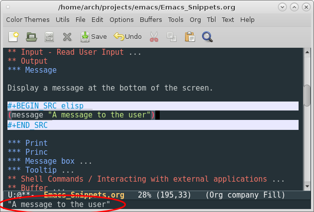

### Print<a id="sec-1-8-2" name="sec-1-8-2"></a>

### Princ<a id="sec-1-8-3" name="sec-1-8-3"></a>

### Message box<a id="sec-1-8-4" name="sec-1-8-4"></a>

Display a message, in a dialog box if possible. If a dialog box is not
available, use the echo area.

```lisp
(message-box "Emacs Alert. Time to drink a coffee!")
```

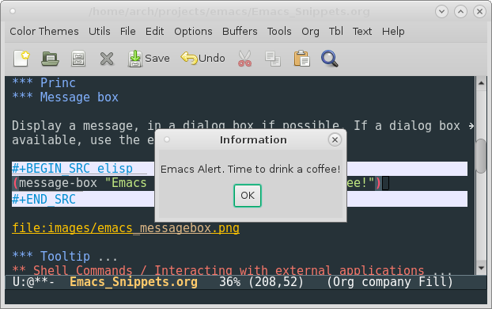

### Tooltip<a id="sec-1-8-5" name="sec-1-8-5"></a>

Show a tooltip

```lisp
(tooltip-show "An Emacs tooltip")
```

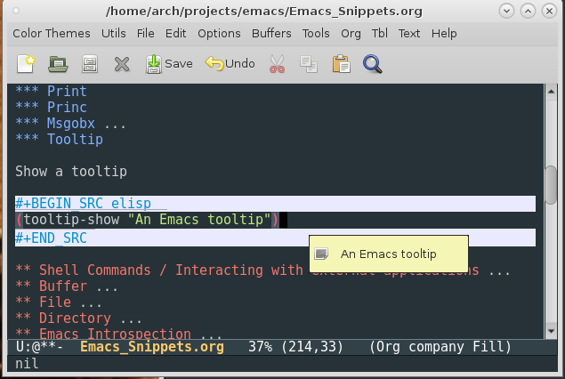

## Shell Commands / Interacting with external applications<a id="sec-1-9" name="sec-1-9"></a>

### Related Documentation<a id="sec-1-9-1" name="sec-1-9-1"></a>

[C-h-f] <name of function>

-   [shell-command]((describe-function%20'shell-command))

-   async-shell-command

-   start-process

-   call-process

-   shell-command-to-string

-   shell-command-on-region

-   getenv

-   setenv

### Synchronous Shell Commands<a id="sec-1-9-2" name="sec-1-9-2"></a>

1.  Display output of shell command

    ```lisp
    (shell-command "uname -a") ;; M-x eval-last-sexp
    ```
    
    

2.  Display output of shell command in another frame

    Display PCI cards in another frame. 
    
    ```lisp
    (with-selected-frame (make-frame)
      (shell-command "lspci"))
    ```

3.  Shell Command To String

    ```lisp
    > (shell-command-to-string "uname -a")  ;; M-x eval-print-last-sexp
    "Linux localhost 4.7.0-1-ARCH #1 SMP PREEMPT Mon Aug 8 22:05:58 CEST 2016 x86_64 GNU/Linux
    "
    
    > (insert (format "\nKernel version %s " (shell-command-to-string "uname -r"))) ;; M-x eval-last-sexp
    
    Kernel version 4.7.0-1-ARCH
     nil
    
    (defun insert-debug-info () 
      (interactive)
    
      (insert (concat "Kernel version : ") (shell-command-to-string "uname -r"))
      (insert (concat "Linux distribution : ") (shell-command-to-string "cat /etc/issue"))
      (insert (concat "Gcc version :") (shell-command-to-string "gcc --version | grep GCC"))
      )
    ;; M-x insert-debug-info 
    
    Kernel version : 4.7.0-1-ARCH
    Linux distribution : Arch Linux \r (\l)
    
    Gcc version :gcc (GCC) 6.1.1 20160802
    ```

4.  Shell Command Wrappers

    The function shell-command-to-lines runs a shell command and returns
    the output lines. This function is useful to create shell command
    wrappers over Unix shell commands like find.
    
    ```lisp
    (defun shell-command-to-lines (command)
      (remove-if-not  (lambda (s) (/= (length s) 0))
                      (split-string
                       (shell-command-to-string command) "\n")))
    
    
    ELISP> (mapc #'princ (shell-command-to-lines "ls /var/log"))
    btmpfailloghttpdjournallastlogoldpacman.logsambaspeech-dispatcherwtmpXorg.0.logXorg.0.log.old
    ("btmp" "faillog" "httpd" "journal" "lastlog" "old" "pacman.log" "samba" "speech-dispatcher" "wtmp" "Xorg.0.log" "Xorg.0.log.old")
    
    ELISP> (mapc (lambda (p) (princ p) (princ "\n")) (shell-command-to-lines "ls /var/log"))
    btmp
    faillog
    httpd
    journal
    lastlog
    old
    pacman.log
    samba
    speech-dispatcher
    wtmp
    Xorg.0.log
    Xorg.0.log.old
    ```
    
    Example: Shell command wrapper find 
    
    ```lisp
    ELISP> (mapc (lambda (p) (princ p) (princ "\n"))  (shell-command-to-lines "find ~/.local/share/ -name \"*.desktop\""))
    /home/arch/.local/share/xfce4/helpers/custom-WebBrowser.desktop
    /home/arch/.local/share/applications/userapp-mono-IAJQMY.desktop
    /home/arch/.local/share/applications/userapp-sh-9VFBMY.desktop
    /home/arch/.local/share/applications/userapp-em-FLD8LY.desktop
    /home/arch/.local/share/applications/userapp-mpv-FLQ9LY.desktop
    /home/arch/.local/share/applications/userapp-Firefox-SOBHMY.desktop
    
    (defun search-files (directory pattern)
      (shell-command-to-lines
       (format "find %s -name '%s'"
               directory
               pattern)))
    
    ELISP> (search-files "~/.local" "*.desktop") ;; Output changed to fit in the screen 
    ("/home/arch/.local/share/xfce4/helpers/custom-WebBrowser.desktop" 
    "/home/arch/.local/share/applications/userapp-mono-IAJQMY.desktop" 
    "/home/arch/.local/share/applications/userapp-sh-9VFBMY.desktop" 
    "/home/arch/.local/share/applications/userapp-em-FLD8LY.desktop" 
    ...
    )
    
    
    ELISP> (mapc (lambda (p) (princ p) (princ "\n")) (search-files "~/.local" "*.desktop"))
    
    /home/arch/.local/share/xfce4/helpers/custom-WebBrowser.desktop
    /home/arch/.local/share/applications/userapp-mono-IAJQMY.desktop
    /home/arch/.local/share/applications/userapp-sh-9VFBMY.desktop
    /home/arch/.local/share/applications/userapp-em-FLD8LY.desktop
    /home/arch/.local/share/applications/userapp-mpv-FLQ9LY.desktop
    /home/arch/.local/share/applications/userapp-Firefox-SOBHMY.desktop
    ```

### Pipe a region to external command<a id="sec-1-9-3" name="sec-1-9-3"></a>

1.  Pipe buffer or region to external command

    Pipes the buffer content to external command and print the output in
    the buffer `*Shell Command Output*`. The command `$ wc -l` counts the
    number of line of the current file.
    
    ```lisp
    > (shell-command-on-region (point-min) (point-max) "wc -l") ;; M-x eval-last-sexp
    ```
    
    Pipes the buffer content to external command `$wc -l` and get the
    output as a string. 
    
    ```lisp
    > (with-output-to-string  ;; M-x eval-print-last-sexp
          (shell-command-on-region (point-min) (point-max) "wc -l"))
    ""
    
    (defun pipe-region-to-command (pmin pmax command)
      (interactive)
    
      (shell-command-on-region
       pmin
       pmax
       command 
       "*shell-output*"
       )
      
      (let (
            (output  (with-current-buffer "*shell-output*"
                        (buffer-substring-no-properties (point-min) (point-max))))
            )
        
        (kill-buffer "*shell-output*")
        output 
        )
      )
    
    
    > (pipe-region-to-command (point-min) (point-max) "wc -l") ;; M-x eval-print-last-sexp 
    "1515
    "
    ```

2.  Apply an external command to buffer

    The command below will pipe the buffer `*scratch*` to the command =$
    sed 's/foo.\*/bar/g'= which replaces all values of foo for bar.
    
    ```lisp
    (with-current-buffer "*scratch*"
        (shell-command-on-region (point-min) (point-max) "sed 's/foo.*/bar/g'" "*shell-output*" t )
    
    ) ;; M-x eval-last-sexp
    ```
    
    Before the form evaluation
    
    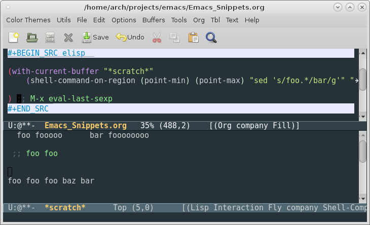
    
    After the form evaluation. 
    
    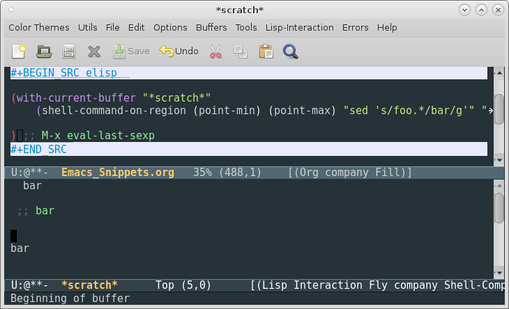

3.  Function to apply an external command to buffer

    Usage: M-x shell-command-on-buffer Enter: sed 's/defun/defn/g' eplaces
    all defun words by defn.
    
    ```lisp
    (defun shell-command-on-buffer (&optional command)
      "Apply a shell command in the current buffer and replace it by the command output. 
    
       Example: 
                - Interactive usage:  M-x shell-command-on-buffer Enter: sed 's/defun/defn/g'. 
                                      replaces all defun words by defn.
    
                - (shell-command-on-buffer \"sed 's/defun/defn/g'\")
      "
      
      (interactive)
      
      (shell-command-on-region (point-min) 
    			   (point-max) 
    			   (if command command (read-string "Cmd on buffer: "))
    			   "*shell-output*" 
    			   t 
    			   )
      )
    ```

4.  Insert line number in all lines of a buffer using ruby

    Enter M-x <span class="underline">shell-command-on-buffer</span> and then $ ruby -ne 'printf("-%6s%s", $., $\_)' 
    
    ```ruby
    ruby -ne 'printf("-%6s%s", $., $_)'
    ```
    
    Before running the command:
    
    
    
    After running the command:
    
    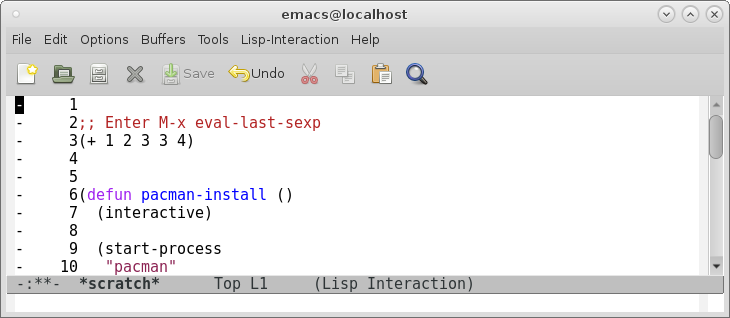

5.  Ruby command on buffer

    This function applies a ruby batch command on the buffer. 
    
    See also: [Ruby One-Liners](http://reference.jumpingmonkey.org/programming_languages/ruby/ruby-one-liners.html)
    
    ```lisp
    (defun ruby-on-buffer (&optional command)
      " 
       Applies a ruby command on buffer 
      
       Example: The command will number each line of the current buffer. 
    
                1. M-x ruby-on-buffer 
                2. type: 'printf(\"%6s%s\", $., $_)' without quotes.
       "
      (interactive)
      
      (shell-command-on-buffer
       (format "ruby -ne '%s'"
               (if command
                   command
                 (read-string "ruby cmd >")))))
    ```
    
    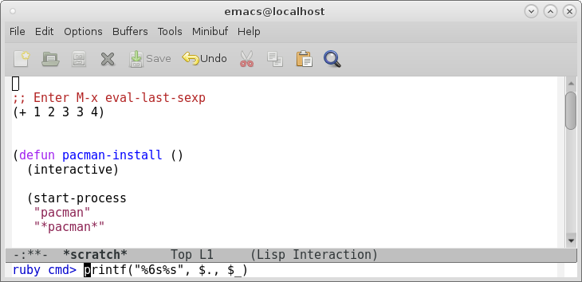

6.  Ruby regex on buffer

    Emacs regexp islimited and doesn't have lookahead like perl or ruby
    regex. This command can extend the functionality of Emacs regex using
    ruby. This function applies a ruby regex on the buffer. 
    
    Usage: M-x ruby-gsub-on-buffer 
    
    See also: [Ruby One-Liners](http://reference.jumpingmonkey.org/programming_languages/ruby/ruby-one-liners.html)
    
    ```lisp
    (defun ruby-gsub-on-buffer (&optional regexp)
       "
       Applies ruby regex, the command $ ruby -pe 'gsub(regexp)' 
       on the current buffer. 
        
       Usage M-x ruby-gsub-on-buffer 
             (ruby-gsub-on-buffer <regexp>)
    
       Example: The Command replace all occurrences 
                of 'defun' by 'defn'.
    
                1. M-x ruby-gsub-on-buffer 
                2. Type /defun/,\"defn\"
     
       "
       (interactive)
       
       (shell-regexp-on-buffer
        (format "ruby -pe 'gsub(%s)'"
               (if regexp
                   regexp
                 (read-string "ruby regex: ")))))
    ```

### Launch apps in Asynchronous mode<a id="sec-1-9-4" name="sec-1-9-4"></a>

### Run asynchronous commands piping the output to a buffer<a id="sec-1-9-5" name="sec-1-9-5"></a>

1.  Ping a host

    -   `(start-process NAME BUFFER PROGRAM &rest PROGRAM-ARGS`
    
    Usage: M-x ping-host or (ping-host <hostname>)
    
    ```lisp
    (defun ping-host (&optional hostname)
      "
      Ping a hostname. 
      
      Usage:  
            - Interactive: M-x ping-host 
            - Command:     (ping-host <hostname>)
    
      Example: (ping-host \"www.google.com\")
               (ping-host \"192.168.0.1\")
      "     
      (interactive)
    
      (let
          (
           (hostname- (if hostname hostname (read-string "host to ping: ")))
           )
        
        ;; (with-selected-frame (make-frame)
        ;;   ;;
        ;;   ;; Process name:    ping 
        ;;   ;; Process buffer: *ping*
        ;;   ;; Command:         ping <hostname>
        ;;   ;;
          
        ;;   (start-process "ping" "*ping*" "ping" hostname-)
      
        ;;   )
    
        (start-process "ping" "*ping*" "ping" hostname-)
        (switch-to-buffer-other-frame "*ping*") 
        ))
    ```
    
    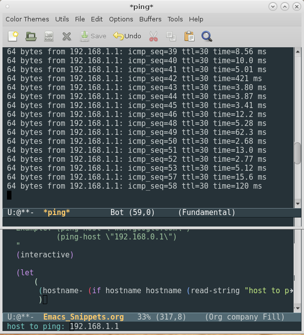

2.  Tracerote a host

    ```lisp
    (defun traceroute-host (&optional hostname)
      "
      Ping a hostname. 
      
      Usage:  
            - Interactive: M-x traceroute-host [Enter the hostname]
            - Command:     (traceroute-host <hostname>)
    
      Example: (traceroute-host \"www.yahoo.co.uk\")
    
      "     
      (interactive)
    
      (let
          (
           (hostname- (if hostname hostname (read-string "host to traceroute: ")))
           )
        
        (start-process "traceroute" "*traceroute*" "traceroute" hostname-)
        (switch-to-buffer-other-frame "*traceroute*") 
        ))
    ```

### Run a ncurses / terminal app<a id="sec-1-9-6" name="sec-1-9-6"></a>

Run linux htop (task manager) inside Emacs: 

```lisp
(term "htop") ;; C-x C-e or M-x eval-last-sexp
```

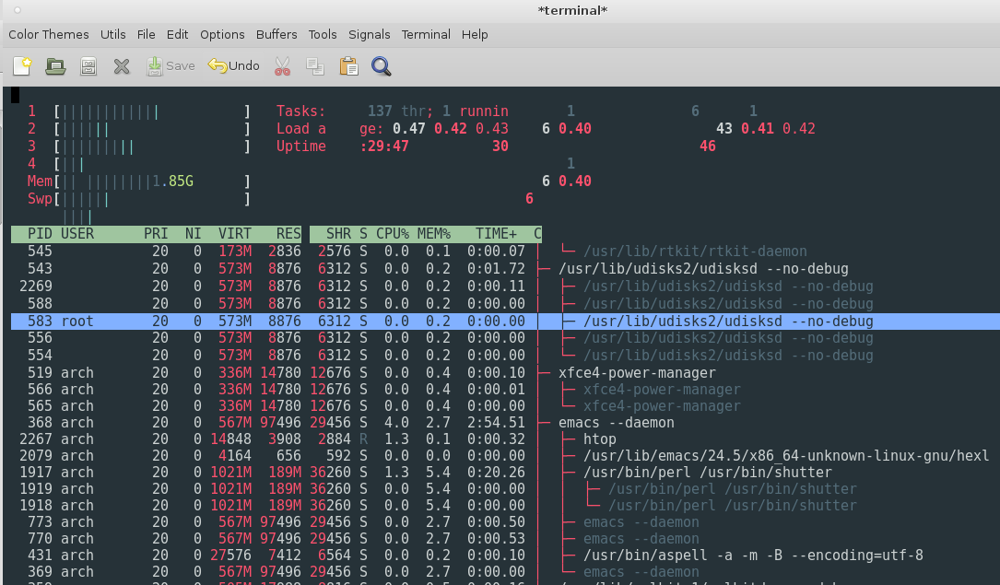

## File<a id="sec-1-10" name="sec-1-10"></a>

### Test if file or directory exists<a id="sec-1-10-1" name="sec-1-10-1"></a>

```lisp
> (file-exists-p "/var/log/pacman.log") ;; M-x eval-print-last-sexp 
t

> (file-exists-p "/var/log/pcaman.log.err")
nil
 ;;
> (file-exists-p "/var/log")
t
 ;;  
> (file-exists-p "/var/log-dont-exists")
nil
```

### Expand file name<a id="sec-1-10-2" name="sec-1-10-2"></a>

```lisp
ELISP> (expand-file-name "~")
"/home/arch"

ELISP> (expand-file-name "~/.emacs.d/init.el")
"/home/arch/.emacs.d/init.el"

ELISP> (expand-file-name ".")
"/home/arch/projects/emacs"
```

### Read file to string<a id="sec-1-10-3" name="sec-1-10-3"></a>

The Emacs API doesn't provide a straightforward way to read file
directly to a string. The only way to perform this taks is using a
temporary buffer. 

```lisp
(defun read-file (filename)
  (with-temp-buffer
    (insert-file-contents filename)
    (buffer-substring-no-properties (point-min) (point-max))))

ELISP> (read-file "/etc/host.conf")
"#\n# /etc/host.conf\n#\n\norder hosts,bind\nmulti on\n\n# End of file\n"

ELISP> (princ (read-file "/etc/host.conf"))
#
# /etc/host.conf
#

order hosts,bind
multi on

# End of file
```

### Open file to edit<a id="sec-1-10-4" name="sec-1-10-4"></a>

1.  Open file to edit in current window

    ```lisp
    > (find-file "/etc/fstab")
    ```

2.  Open file to edit in anther window

    ```lisp
    (find-file-other-window "/etc/fstab")
    ```

3.  Open file to edit in anther frame

    ```lisp
    (find-file-other-frame "/etc/fstab")
    ```

### Open file to edit silently<a id="sec-1-10-5" name="sec-1-10-5"></a>

Function: find-file-nonselect 

Emacs Documentation: Read file FILENAME into a buffer and return the
buffer.If a buffer exists visiting FILENAME, return that one, but
verify that the file has not changed since visited or saved. The
buffer is not selected, just returned to the caller.

Open a file and returns a buffer:

```lisp
> (setq b1 (find-file-noselect "~/.bashrc"))
#<buffer .bashrc>

> b1
#<buffer .bashrc>
```

## Directory<a id="sec-1-11" name="sec-1-11"></a>

### Open directory<a id="sec-1-11-1" name="sec-1-11-1"></a>

1.  Open directory in current window

    ```lisp
    (dired "/var/log")
    ```

2.  Open directory in another window

    ```lisp
    (dired-other-window "/var/log")
    ```

3.  Open directory in another frame

    ```lisp
    (dired-other-frame "/var/log")
    ```
    
    

### Create directory<a id="sec-1-11-2" name="sec-1-11-2"></a>

### List directory<a id="sec-1-11-3" name="sec-1-11-3"></a>

Get directory content 

```lisp
ELISP> (directory-files "/var/log")

("." ".." "Xorg.0.log" "Xorg.0.log.old" ... )
```

Print the directory content in elisp shell IEML.

```lisp
ELISP> (mapc #'(lambda (p) (princ (concat "\n" p))) 
               (directory-files "/var/log") )

.
..
Xorg.0.log
Xorg.0.log.old
btmp
faillog
httpd
journal
lastlog
old
pacman.log
samba
speech-dispatcher
wtmp
```

Get directory content with absolute file name. 

```lisp
ELISP> (directory-files "/var/log" t)
("/var/log/." "/var/log/.." "/var/log/Xorg.0.log" "/var/log/Xorg.0.log.old" ... )

ELISP> (mapc #'(lambda (p) (princ (concat "\n" p))) 
               (directory-files "/var/log" t ))

/var/log/.
/var/log/..
/var/log/Xorg.0.log
/var/log/Xorg.0.log.old
/var/log/btmp
...
```

List files of a specific extension: 

```lisp
;; Files ending with *.conf 

ELISP> (directory-files "/etc/" nil "\\.conf")
("asound.conf" "dhcpcd.conf" "fuse.conf" "gai.conf" ...)

ELISP> (directory-files "/etc/" t "\\.conf")
("/etc/asound.conf" "/etc/dhcpcd.conf" "/etc/fuse.conf"  ...)

ELISP> (directory-files "/etc/" t "\\.cfg")
("/etc/rc_maps.cfg" "/etc/vdpau_wrapper.cfg")

ELISP> (directory-files "/etc/" nil "\\.cfg")
("rc_maps.cfg" "vdpau_wrapper.cfg")
```

## Text Manipulation<a id="sec-1-12" name="sec-1-12"></a>

### Text alignment<a id="sec-1-12-1" name="sec-1-12-1"></a>

Source: [Init file](http://www.svjatoslav.eu/notes/init.html) - www.svjatoslav.eu

```lisp
(defun align-to-colon (begin end)
  "Align region to colon (:) signs"
  (interactive "r")

  (align-regexp begin end
                (rx (group (zero-or-more (syntax whitespace))) ":") 1 1 ))

(defun align-to-comma (begin end)
  "Align region to comma signs"
  (interactive "r")
  (align-regexp begin end
                (rx "," (group (zero-or-more (syntax whitespace))) ) 1 1 ))


(defun align-to-equals (begin end)
  "Align region to equal signs"
  (interactive "r")
  (align-regexp begin end
                (rx (group (zero-or-more (syntax whitespace))) "=") 1 1 ))

(defun align-to-hash (begin end)
  "Align region to hash ( => ) signs"
  (interactive "r")
  (align-regexp begin end
                (rx (group (zero-or-more (syntax whitespace))) "=>") 1 1 ))

;; work with this
(defun align-to-comma-before (begin end)
  "Align region to equal signs"
  (interactive "r")
  (align-regexp begin end
                (rx (group (zero-or-more (syntax whitespace))) ",") 1 1 ))
```

### Join Multiple Lines<a id="sec-1-12-2" name="sec-1-12-2"></a>

From: [jidaikobo-shibata/join-multi-lines-to-one.el](https://gist.github.com/jidaikobo-shibata/ee6b2f8ef659ed58605d)

```lisp
(defun join-multi-lines-to-one ()
  "Join multi lines."
  (interactive)
  (let ((beg (region-beginning))
        (end (region-end))
        strings)
    (goto-char beg)
    (back-to-indentation)
    (setq beg (point))
    (goto-char end)
    (goto-char (- (point) 1))
    (end-of-line)
    (setq end (point))
    (setq strings (buffer-substring-no-properties beg end))
    (setq strings (replace-regexp-in-string "\n\\|^>+ *\\|^[\t　 ]+" " " strings))
    (setq strings (replace-regexp-in-string " +" " " strings))
    (delete-region beg end)
    (insert strings)
(goto-char beg)))
```

## Emacs Introspection<a id="sec-1-13" name="sec-1-13"></a>

### User init file<a id="sec-1-13-1" name="sec-1-13-1"></a>

```lisp
ELISP> user-init-file
"/home/arch/.emacs.d/init.el"

ELISP> (expand-file-name user-init-file)
"/home/arch/.emacs.d/init.el"
```

### User Emacs Directory<a id="sec-1-13-2" name="sec-1-13-2"></a>

```lisp
ELISP> user-emacs-directory
"~/.emacs.d/"

ELISP> (expand-file-name user-emacs-directory)
"/home/arch/.emacs.d/"
```

### Enviroment Variables<a id="sec-1-13-3" name="sec-1-13-3"></a>

### Get current Operating System<a id="sec-1-13-4" name="sec-1-13-4"></a>

### Test if Emacs is running in terminal or in window system<a id="sec-1-13-5" name="sec-1-13-5"></a>

The variable <span class="underline">window-system</span> is the name of window system through
which the selected frame is displayed.

Its value is a symbol:

-   nil for a termcap frame (a character-only terminal)
-   'x' for an Emacs frame that is really an X window
-   'w32' for an Emacs frame that is a window on MS-Windows display
-   'ns' for an Emacs frame on a GNUstep or Macintosh Cocoa display
-   'pc' for a direct-write MS-DOS frame.

```lisp
(defun test-window-system ()
  (interactive)
  
  (if window-system
       (message  "Running in Window System / GUI")
       (message "Running in terminal ")
       ))

;; In GUI
;;-----------------------------
> (test-window-system)  ;; M-x eval-print-last-sexp
"Running in Window System / GUI"

;; In Terminal
;;------------------------------
> (test-window-system)  ;; M-x eval-print-last-sexp
"Running in terminal "
```

## Web Browser<a id="sec-1-14" name="sec-1-14"></a>

### Browse Url<a id="sec-1-14-1" name="sec-1-14-1"></a>

Open <http://www.yandex.com> in the web browser 

```lisp
> (browse-url "http://www.yandex.com")
```

Function to open Yandex.com. Usage M-x <span class="underline">open-yandex</span>

```lisp
(defun open-yandex ()
  "Open the web site http://www.yandex.com"
  (interactive)
  (browse-url "http://www.yandex.com")
  )
```

### Browser Url setting the web browser<a id="sec-1-14-2" name="sec-1-14-2"></a>

Open url with firefox 

```lisp
(let ((browse-url-browser-function 'browse-url-firefox))
  (browse-url "http://www.yandex.com"))

;; Or 

;; Set browser permanently
(setq browse-url-browser-function 'browse-url-firefox)
```

Open url with chromium browser or chrome 

```lisp
(let ((browse-url-browser-function 'browse-url-chromium))
  (browse-url "http://www.yandex.com"))

;;; Or 

;; Set browser permanently
(setq browse-url-browser-function 'browse-url-chromium)
```

Open url with Emacs eww browser 

```lisp
(let ((browse-url-browser-function 'eww-browse-url))
  (browse-url "http://www.yandex.com")

;;; Or 

;; Set browser permanently
(setq browse-url-browser-function 'eww-browse-url)
```

### Search Web sites with Emacs<a id="sec-1-14-3" name="sec-1-14-3"></a>

1.  Search google

    Usage: M-x search-google 
    
    ```lisp
    (require 'url-util)
    
    (defun search-google ()
       (interactive)
       "Search www.google.ca"
       (browse-url (format "http://www.google.ca?gws_rd=ssl#q=%s" (url-encode-url (read-string "Google: ")))))
    ```

2.  Search a specific url site with google

    Usage:
    
    -   M-x search-hackernews-with-google
    
    -   M-x search-reddit-with-google
    
    -   M-x search-stackoverflow-with-gooogle
    
    ```lisp
    Usage: M-x search-google 
    
    (require 'url-util)
    
    (defun search-google-url (url params)
       (let ((google-url  (format "site:%s %s" url params))) 
         (browse-url (format "http://www.google.ca?gws_rd=ssl#q=%s" (url-encode-url google-url)))))
    
    (search-google-url "https://news.ycombinator.com" "haskell production")
    
    (defun search-hackernews-with-google ()
       (interactive)
       (search-google-url "https://news.ycombinator.com" (read-string "Hnews: ")))
    
    (defun search-reddit-with-google () 
       (interactive)
       (search-google-url "https://www.reddit.com" (read-string "Reddit: ")))
    
    (defun search-stackoverflow-with-google () 
       (interactive)
       (search-google-url "http://stackoverflow.com" (read-string "S.O Search: ")))
    ```

3.  Search github

    ```lisp
    (require 'url-util)
    
    (defun search-github ()
       (interactive)
       "Search www.google.ca"
       (browse-url (format "https://github.com/search?q=%s" (url-encode-url (read-string "Github Search: ")))))
    ```

4.  Search gisthub

    ```lisp
    (require 'url-util)
    
    (defun search-gisthub ()
       "
        Search gisthub : http://gist.github.com 
        Usage: M-x search-gisthub
       "
       (interactive)
       (browse-url (format "https://gist.github.com/search?p=50&q=%s&ref=searchresults" (url-encode-url (read-string "Gisthub Search: ")))))
    ```

5.  Open Emacs Web Manual

    ```lisp
    (defun open-emacs-manual ()
      "
      Open Emacs online Manual
      
      Usage: M-x open-emacs-manual
    
      It opens the web site: https://www.gnu.org/software/emacs/manual
      "
      (interactive)
      (browse-url "https://www.gnu.org/software/emacs/manual/"))
    ```

## Packages<a id="sec-1-15" name="sec-1-15"></a>

### Test if package is installed<a id="sec-1-15-1" name="sec-1-15-1"></a>

### Install a package if it is not installed<a id="sec-1-15-2" name="sec-1-15-2"></a>

## Dired mode snippets<a id="sec-1-16" name="sec-1-16"></a>

The dired mode is the mode used by Emacs to browser directories.

See also: [How do you customize dired?](https://www.reddit.com/r/emacs/comments/4agkye/how_do_you_customize_dired/)

Source: [hiroina/.emacs](https://gist.github.com/hiroina/4702961)

-   Copy path of file at point.

```lisp
(defun dired-copy-path ()
  "In dired, copy file path to kill-buffer.  At 2nd time it copy current directory to kill-buffer."
  (interactive)
  (let (path)
    (setq path (dired-file-name-at-point))
	(if (string= path (current-kill 0 1)) (setq path (dired-current-directory)))
    (message path)
    (kill-new path)
  )
)
```

-   Open directory at point with Microsoft Explorer in Windows OS.

```lisp
(defun dired-exec-explorer ()
  "In dired, execute Explorer"
  (interactive)
  (let (path)
    (setq path (dired-file-name-at-point))
    (setq path (replace-regexp-in-string "~" "c:/home" path))
    (setq path (replace-regexp-in-string "/" "\\\\" path))
    (message path)
    ;(kill-new path)
    (start-process "explorer" nil "explorer" (concat "/select," path))
  )
)
```

## Helm Snippets<a id="sec-1-17" name="sec-1-17"></a>

### Browser Recent files<a id="sec-1-17-1" name="sec-1-17-1"></a>

Usage: M-x helm-recent-files 

```lisp
(require 'helm)

(defun helm-recent-files ()
  (interactive)
  
  (helm
   :prompt "File: "
   :sources  `((
                (name       . "File: ")
                (candidates . ,recentf-list)
                (action     . find-file)
                ))))
```


### Browser Recent directories<a id="sec-1-17-2" name="sec-1-17-2"></a>

Usage M-x helm-recent-dirs 

```lisp
(require 'helm)

(defun unique (xs)
  "Remove repeated elements from list xs
 
  Example:
  
  > (unique '(x y a b 21 21 10 21 x y a ))
  (x y a b 21 10)
  "
  (let
    ((result nil))   

    (dolist (x xs)
      (if (not (member x result))
          (push x result)         
        ))
    (reverse result)
    ))

(defun helm-recent-dirs ()
  (interactive)
  
  (helm
   :prompt "Dir: "
   :sources  `((
                (name       . "Dir: ")
                (candidates . (lambda () (unique (map #'file-name-directory recentf-list))))
                (action     . dired)
                ))))
```

### Launch ansync shell command with helm<a id="sec-1-17-3" name="sec-1-17-3"></a>

This piece of code gets all executables in the $PATH variable and
searche for one that matches the user input and then launches it. It
is useful to launch applications without block Emacs.

Usage: M-x helm-laucher 

```lisp
(defun get-executables ()
  
  "
  Returns a list of all files available in the directories of the $PATH
  variable. 
  "
  (apply #'append  
   (mapcar  (lambda (p) (directory-files p t))      
            (remove-if-not #'file-exists-p
                        (split-string (getenv "PATH") ":")))))


(defun run-async  (&optional command)
  
  "Run a shell command in asynchronous mode. 
   It doesn't block Emacs while the command 
   is running. 

   Usage:  (run-async \"python -m http.server\")
           M-x run-async  -> User enters a command. 
  "

  (interactive)
  
  (apply #'start-process

         `(
           

           "proc-any"          ;; We don't care about the application name 

           nil                 ;; Don't name the buffer 

           ,@(split-string-and-unquote

              (if  command
                   command
                   (read-string "Command: "  )
                  )) 

           )))

(defun run-async-lst (&rest commands) 
  "
  Run a shell command in asynchronus mode, not blocking Emacs.

  Usage:    > (run-async-lst <program> <argument 1> <agurment2> ...)
  Example:  > (run-async \"thunar\" \"/usr/share/applications\")
  "
  (apply #'start-process

         `(
           "dontcare"          ;; We don't care about the application name 
           nil                 ;; Don't name the buffer 
           ,@commands

           )))


(defun helm-launcher ()
  
  " Launches applications available in $PATH directories in
    asynchronous mode without Emacs wait for it.    
    Usage M-x heml-launcher 
  "
  (interactive)

  (let
      ((data      (mapcar (lambda (p) (cons  (file-name-nondirectory p)
                                             p
                                             ))

                          (get-executables)
                          )             
        ))

   (helm
   :prompt "Shell: "
   :sources  `((
                (name       . "Shell: ")
                (candidates . ,data)
                (action     . run-async)
                )))))
```


### Switch between buffers associated with files<a id="sec-1-17-4" name="sec-1-17-4"></a>

Switch between buffers associated with files.

```lisp
(defun switch-file ()
  "
  Switch between buffers that are associated with files. 
  Depends on helm. 
 

  Usage: M-x switch file.
 
  "
  (interactive)

  (let ((data  (mapcar (lambda (b)  (cons (buffer-file-name b) b ))
                       (remove-if-not #'buffer-file-name (buffer-list)))))
    (helm
     :prompt "Buffer: "
     :sources  `((
                  (name       . "File Buffers")
                  (candidates . ,data)
                  (action     . switch-to-buffer)
                  )))

    ))
```

### Switch between Emacs major modes<a id="sec-1-17-5" name="sec-1-17-5"></a>

```lisp
(defun helm-switch-mode ()
  "
   Switch between all major programming modes available in Emacs. 

   Usage: M-x helm-switch-mode
  "
  (interactive)

  (cl-flet ((unique (xs)
                    (let
                        ((result nil))   

                      (dolist (x xs)
                        (if (not (member x result))
                            (push x result)         
                          ))
                      (reverse result)
                      )

                    ))

    (helm
     :prompt "Mode: "
     :sources  `((
                  (name       . "Emacs Major Modes")

                  (candidates . ,(unique (mapcar #'symbol-name
                                                 (remove-if-not #'symbolp
                                                   (mapcar #'cdr auto-mode-alist)))))
         
                  
                  
                  (action     . ,(lambda (m) (funcall (intern-soft m))))

                  )))
    )
  )
```

### Open a list of web sites<a id="sec-1-17-6" name="sec-1-17-6"></a>

```lisp
(setq helm-url-default-url-list

      '(
        ("google" . "http://www.google.ca")
        ("yandex"  . "http://www.yandex.com")
        ("reddit" . "http://www.reddit.com")
        ("/r/haskell". "http://www.reddit.com/r/haskell")
        ("/r/emacs" . "http://www.reddit.com/r/emacs")
        ("/r/csharp" . "http://www.reddit.com/r/csharp")
        )

      )

(defun helm-web ()
  (interactive)
  (helm
     :prompt "Web Site: "
     :sources  `((
                  (name       . "Bookmarks")
                  (candidates . helm-url-default-url-list)
                  (action     . (lambda (c) (browse-url (cdr c))) )
                  )))
  )
```

## Eshell<a id="sec-1-18" name="sec-1-18"></a>

### Overview<a id="sec-1-18-1" name="sec-1-18-1"></a>

Eshell is a shell implemented in Emacs with many commands implemented
in Elisp which makes it cross platform, the commands ls, pwd, cd and
etc. works in the same way for Linux, Windows or OSX. In Windows OS it
is a good alternative to cmd.exe. 

Command to clear Eshell. It can be invoked with $ clear in eshell.

See also:

-   [Mastering Eshell](https://www.masteringemacs.org/article/complete-guide-mastering-eshell) / Mastering Emacs

-   [Finally wrapping my head around eshell (the emacs shell)](http://www.blogbyben.com/2013/08/finally-wrapping-my-head-around-eshell.html)

-   

### Start Eshell Directly from command line<a id="sec-1-18-2" name="sec-1-18-2"></a>

Start eshell directly in a new Emacs sessions in the terminal wihout
load init.el.

```sh
$ emacs -Q -q -nw --eval '(eshell)'
```

Or 

```sh
$ emacs -Q -q -nw -f eshell
```


Start eshell directly in a new Emacs Window 

```sh
emacs -q -f eshell # Don't load init file.
```

Or 

```sh
emacs -q -f eshell # Load init file
```

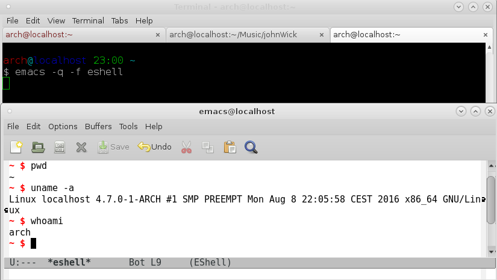

### Useful elisp commands inside eshell<a id="sec-1-18-3" name="sec-1-18-3"></a>

Eshell can run Elisp command - M-x <command> like ordinary Unix shell
apps. 

Open a file in the current window

-   `$ find-file /etc/hosts.conf`

Open a file in other window 

-   `$ find-file-other-window /etc/host.conf`

Open a file in other frame 

-   `$ find-file-other-frame /etc/host.conf`

Browser a directory in current window 

-   `$ dired /var/log`

Browser a directory in another window 

-   `$ dired-other-window /var/log`

Browser a directory in another frame 

-   `$ dired-other-frame /var/log`

### Clear eshell<a id="sec-1-18-4" name="sec-1-18-4"></a>

```lisp
(defun eshell/clear ()
  "clear the eshell buffer."
  (interactive)
  (let ((inhibit-read-only t))
    (erase-buffer)))
```

In eshell:

```sh
~ $ which eshell
eshell is an interactive compiled Lisp function in `eshell.el'
~ $
```

Before the command clear:

 

After the command clear:

 

### Set eshell prompt<a id="sec-1-18-5" name="sec-1-18-5"></a>

1.  Simple prompt

    ```lisp
    (setq eshell-prompt-function (lambda () "eshell > "))
    ```
    
    
    
    **Prompt with current directory**

2.  Colorized prompt

    ```lisp
    (setq eshell-prompt-function
          (lambda nil
          	(concat
          	 (propertize (eshell/pwd) 'face '(:foreground "#8787af"))
          	 (propertize "❯" 'face '(:foreground "#f75f5f"))
          	 (propertize "❯" 'face '(:foreground "#ffaf5f"))
          	 (propertize "❯" 'face '(:foreground "#87af5f"))
    	 (propertize " " 'face nil))))
    ```
    
    

### Change Eshell current directory<a id="sec-1-18-6" name="sec-1-18-6"></a>

This command can be used in Menus or with helm.

```lisp
(defun eshell-chdir (path)  
  (with-current-buffer "*eshell*"
    (cd path)
    (eshell-emit-prompt)))

(eshell-chdir "~/Downloads")
```

### Change Eshell current directory to current buffer<a id="sec-1-18-7" name="sec-1-18-7"></a>

Usage: M-x eshell-cwd

```lisp
(defun eshell-cwd ()
  "
  Sets the eshell directory to the current buffer
  
  Usage: M-x eshell-cwd 
  "
  (interactive)

  (let (
        (path (file-name-directory (or  (buffer-file-name) default-directory)))
       )

    (with-current-buffer "*eshell*"
      (cd path)
      (eshell-emit-prompt))))
```

### Open eshell in another window<a id="sec-1-18-8" name="sec-1-18-8"></a>

Source: [mini-eshell.el](https://gist.github.com/semmypurewal/b7748e0d6785f3c50e46)

Usage: M-x open-mini-eshell 

```lisp
;; open up a mini-eshell
(defun quarter-window-vertically ()
  "create a new window a quarter size of the current window"
  (split-window-vertically)
  (other-window 1)
  (split-window-vertically)
  (other-window -1)
  (delete-window)
)

(defun open-mini-eshell ()
  "open a mini-eshell in a small window at the bottom of the current window"
  (interactive)
  (quarter-window-vertically)
  (other-window 1)
  (eshell)
)
```

### Open eshell in another frame<a id="sec-1-18-9" name="sec-1-18-9"></a>

Usage: M-x eshell-other-frame 

```lisp
(defun eshell-other-frame ()
  "
  Open eshell in another frame.

  Usage: M-x eshell-other-frame 
  "
  (interactive)
  (with-selected-frame (make-frame)
    (eshell)))
```

### Open eshell file names from ls output with Return key<a id="sec-1-18-10" name="sec-1-18-10"></a>

Source: [Emacs Wiki](https://www.emacswiki.org/emacs/EshellEnhancedLS)  

This code allows to open files from `$ ls` command output by selecting
the file name and hitting return or by clicking with the middle mouse
button.

```lisp
(eval-after-load "em-ls"
    '(progn
       (defun ted-eshell-ls-find-file-at-point (point)
         "RET on Eshell's `ls' output to open files."
         (interactive "d")
         (find-file (buffer-substring-no-properties
                     (previous-single-property-change point 'help-echo)
                     (next-single-property-change point 'help-echo))))

       (defun pat-eshell-ls-find-file-at-mouse-click (event)
         "Middle click on Eshell's `ls' output to open files.
 From Patrick Anderson via the wiki."
         (interactive "e")
         (ted-eshell-ls-find-file-at-point (posn-point (event-end event))))

       (let ((map (make-sparse-keymap)))
         (define-key map (kbd "RET")      'ted-eshell-ls-find-file-at-point)
         (define-key map (kbd "<return>") 'ted-eshell-ls-find-file-at-point)
         (define-key map (kbd "<mouse-2>") 'pat-eshell-ls-find-file-at-mouse-click)
         (defvar ted-eshell-ls-keymap map))

       (defadvice eshell-ls-decorated-name (after ted-electrify-ls activate)
         "Eshell's `ls' now lets you click or RET on file names to open them."
         (add-text-properties 0 (length ad-return-value)
                              (list 'help-echo "RET, mouse-2: visit this file"
                                    'mouse-face 'highlight
                                    'keymap ted-eshell-ls-keymap)
                              ad-return-value)
         ad-return-value)))
```

### Functions to copy eshell data to clipboard<a id="sec-1-18-11" name="sec-1-18-11"></a>

1.  Copy current directory

    ```lisp
    (defun clipboard/set (astring)
      "Copy a string to clipboard"
    
       (with-temp-buffer
        (insert astring)
        (clipboard-kill-region (point-min) (point-max))))
    
    ;; Copy current directory to clipboard 
    ;;
    ;; Usage:  Enter $ copy-pwd in eshell 
    ;;
    (defun eshell/copy-pwd ()
     (clipboard/set (eshell/pwd)))
    
    ;; Copy file name with full path to clipboard 
    ;;
    ;; Usage: Enter $ copy-fpath <filename> in eshell. 
    ;; 
    (defun eshell/copy-fpath (fname)
    
      (let ((fpath (concat (eshell/pwd) "/" fname)))
    
           (clipboard/set fpath)
           (concat "Copied path: " fpath)))
    ```
    
    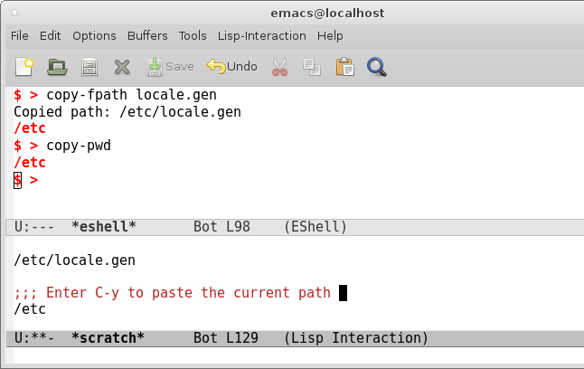

### Creating Eshell aliases programatically<a id="sec-1-18-12" name="sec-1-18-12"></a>

```lisp
(eshell/alias "ff" "find-file $1")

(eshell/alias "fw" "find-file-other-window $1")

(eshell/alias "fr" "find-file-other-frame $1")
```

Example of usage:

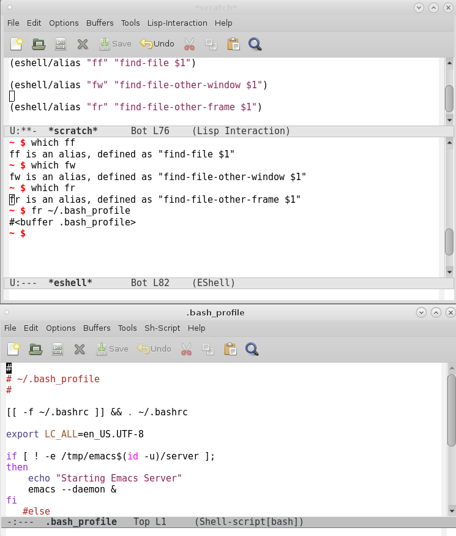

## Non categorized<a id="sec-1-19" name="sec-1-19"></a>

### Save the scratch buffer and reload every Emacs startup<a id="sec-1-19-1" name="sec-1-19-1"></a>

Saves the scratch buffer to a file every times Emacs is closed.

Source: [scratch.el](https://gist.github.com/kobapan/034d5123321b32bb68ca)

```lisp
(setq scratch-buffer-file "~/.emacs.d/scratch.el")

(setq initial-scratch-message "")           ;initial message
(add-hook 'kill-emacs-hook 'scratch-save)   ; 
(add-hook 'window-setup-hook 'scratch-resume); 

;;  window-setup-hook 
;;  @see info 38.1.1 Summary: Sequence of Actions at Startup
(add-hook 'kill-buffer-hook; *scratch* 
          (lambda ()
            (if (equal (buffer-name) "*scratch*") (scratch-save))))

(add-hook 'after-save-hook        
          (lambda ()
            (unless (get-buffer "*scratch*") (scratch-resume))))


(defun scratch-save ()
  (let ((buf (get-buffer "*scratch*")))
    (when buf
      (set-buffer buf)
      (write-file scratch-buffer-file)
      (ignore-errors (kill-buffer "scratch.el")))))

(defun scratch-resume ()
  "*scratch* "
  (interactive)
  (set-buffer (get-buffer-create "*scratch*"))
  (funcall initial-major-mode)
  (insert-file-contents scratch-buffer-file nil nil nil t)
  
  (ignore-errors (kill-buffer ".scratch")))
```

# Configuration Snippetes<a id="sec-2" name="sec-2"></a>

## Save Minibuffer History<a id="sec-2-1" name="sec-2-1"></a>

Saves the minibuffer history on every Emacs session. 

```lisp
(savehist-mode 1)
(setq savehist-additional-variables '(kill-ring search-ring regexp-search-ring))

;; To set the file which the minibuffer is saved use:
(setq savehist-file "~/.emacs.d/tmp/savehist")
```

# Emacs Server and Client<a id="sec-3" name="sec-3"></a>

See also:

-   <https://www.emacswiki.org/emacs/EmacsClient>

-   <https://www.emacswiki.org/emacs/EmacsAsDaemon>

-   [How I Use Emacs - mjwall.com](http://mjwall.com/blog/2013/10/04/how-i-use-emacs/)

-   [Running Multiple Emacs Daemons on a Single System](http://www.tychoish.com/posts/running-multiple-emacs-daemons-on-a-single-system/)

-   [Running emacs as a daemon with systemd](http://blog.refu.co/?p=1296)

-   <http://emacs-fu.blogspot.com.br/2009/02/emacs-daemon.html>

-   <https://wiki.archlinux.org/index.php/Emacs>

-   [Doing worker processing with EmacsLisp](https://gist.github.com/nicferrier/1323512)

-   [Packages for Emacs Programmers](http://nic.ferrier.me.uk/blog/2012_07/emacs-packages-for-programmers)

# Useful Elisp Info Pages<a id="sec-4" name="sec-4"></a>

## Elisp<a id="sec-4-1" name="sec-4-1"></a>

Elisp Top Page

```lisp
(info "(elisp) Top")
```

Elisp Info Page

```lisp
(info "(elisp)")
```

Introduction to programming Elisp

```lisp
(info "(eintr)")
```

Tips about documenting Elisp 

```lisp
(info "(elisp)Documentation Tips")
```

## Customization<a id="sec-4-2" name="sec-4-2"></a>

**Customization:**

```lisp
(info "(emacs) Customization")
```

**Define Customizable Interface**

```lisp
(info "(elisp) Customization")
```

## Layout<a id="sec-4-3" name="sec-4-3"></a>

```lisp
(info "(emacs) Fonts")
```

## Syntax Tables<a id="sec-4-4" name="sec-4-4"></a>

```lisp
(info "(elisp) Syntax Tables")
```

## Environment Variables and OS Detection<a id="sec-4-5" name="sec-4-5"></a>

```lisp
(info "(elisp) System Environment")
```

## Subprocess Creation<a id="sec-4-6" name="sec-4-6"></a>

```lisp
(info "(elisp) Subprocess Creation")
```

## Keybindings<a id="sec-4-7" name="sec-4-7"></a>

```lisp
(info "(elisp) Function Keys")
```

```lisp
(info "(elisp) Keys in Documentation")
```

```lisp
(info "(emacs) Windows Keyboard")
```

## Hooks (Events Callbacks)<a id="sec-4-8" name="sec-4-8"></a>

```lisp
(info "(elisp) Hooks")
```

```lisp
(info "(elisp) Setting Hooks")
```

```lisp
(info "(elisp) Advising Functions")
```

## Buffer<a id="sec-4-9" name="sec-4-9"></a>

Buffers 

```lisp
(info "(elisp) Buffers")
```

Buffer Content 

```lisp
(info "(elisp) Buffer Contents")
```

Cursor 

```lisp
(info "(elisp) Positions")
```

Hooks

```lisp
(info "(elisp)Change Hooks")
```

Motion 

```lisp
(info "(elisp) Motion")
```

Text and Strings 

```lisp
(info "(elisp) Text")
```

```lisp
(info "(elisp) Strings and Characters")
```

Buffer Local Variable 

```lisp
(info "(emacs) File Variables")
```

## Window<a id="sec-4-10" name="sec-4-10"></a>

Frame

```lisp
(info "(elisp) Windows")
```

## Frame<a id="sec-4-11" name="sec-4-11"></a>

Frame

```lisp
(info "(elisp) Frames")
```

Frame Parameters 

```lisp
(info "(elisp) Frame Parameters")
```

## Files<a id="sec-4-12" name="sec-4-12"></a>

Files 

```lisp
(info "(elisp) Files")
```

Change Files 

```lisp
(info "(elisp) Changing Files")
```

File Name Components 

```lisp
(info "(elisp) File Name Components")
```

Buffer Local Variable 

```lisp
(info "(emacs) File Variables")
```

## Text Enconding ISO UTF8 &#x2026;<a id="sec-4-13" name="sec-4-13"></a>

```lisp
(info "(emacs) International")
```

## Loading, Libraries and Packages<a id="sec-4-14" name="sec-4-14"></a>

Loading 

```lisp
(info "(elisp) How Programs Do Loading")
```

```lisp
(info "(elisp) Loading")
```

Libraries 

```lisp
(info "(emacs) Lisp Libraries")
```

Packages 

```lisp
(info "(elisp) Packaging")
```

## Batch Mode<a id="sec-4-15" name="sec-4-15"></a>

Batch Mode

```lisp
(info "(elisp) Batch Mode")
```

## Syntax Highlight<a id="sec-4-16" name="sec-4-16"></a>

```lisp
(info "(elisp) Syntax Class Table")
```

# Selected Gists<a id="sec-5" name="sec-5"></a>

-   [extract archives from eshell](https://gist.github.com/justinabrahms/1390864)

-   [garaud/pipe-to-emacs.py](https://gist.github.com/garaud/06b38554103aa7120337) - Pipe to Emacs: Insert a result from an
    UNIX command into a new Emacs buffer

-   [dvnmk/process](https://gist.github.com/dvnmk/c76105bf0eb5a73565ca) - Play youtube playlist using Emacs + mpv player.

-   [TikhonJelvis/epage](https://gist.github.com/TikhonJelvis/b921933b437d6502c3ff) - "A little pager script I wrote that calls out to emacsclient."

-   [Elisp code to create a rails console ](https://gist.github.com/rosarinjroy/2417726)
